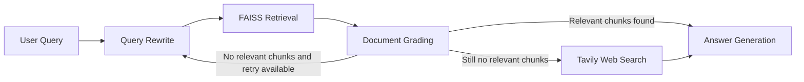

# RAG Technical Documentation Assistant

A beginner-friendly RAG project for an AI/ML Engineer Intern assignment. It uses FastAPI for the backend, Streamlit for the frontend, LangGraph for the retrieval workflow, FAISS for vector search, Gemini for LLM + embeddings, and Tavily as a fallback web search when the indexed documents are not enough.

## Project Overview

The app answers questions about technical documentation stored in the local `docs/` folder. The workflow:

1. rewrites the user query for better retrieval
2. retrieves the most relevant chunks from FAISS
3. grades each chunk with Gemini as relevant or irrelevant
4. routes based on the grading result
5. generates a grounded answer with source citations
6. falls back to Tavily web search if the local documents are not enough after one retry

This keeps the system simple, explainable, and close to the assignment requirements.

## Architecture

### LangGraph Flow



### High-Level Components

- `app/ingestion.py`: loads files from `docs/`, splits them, embeds them, and saves the FAISS index
- `app/rag_graph.py`: contains the LangGraph workflow
- `app/main.py`: exposes the FastAPI endpoints
- `streamlit_app.py`: minimal frontend for asking questions and sending feedback

## Project Structure

```text
.
├── app/
│   ├── __init__.py
│   ├── config.py
│   ├── ingestion.py
│   ├── main.py
│   ├── rag_graph.py
│   └── schemas.py
├── docs/
├── .env.example
├── .gitignore
├── README.md
├── requirements.txt
└── streamlit_app.py
```

Notes:

- `docs/` is intentionally kept empty so you can paste your own technical documents later.
- `faiss_index/` is not committed and is created automatically after running ingestion.

## Setup Instructions

### 1. Clone the project and move into it

```bash
git clone <your-repo-url>
cd <your-repo-folder>
```

### 2. Create and activate a virtual environment

```bash
python -m venv .venv
```

Windows:

```bash
.venv\Scripts\activate
```

macOS/Linux:

```bash
source .venv/bin/activate
```

### 3. Install dependencies

```bash
pip install -r requirements.txt
```

### 4. Create a `.env` file

Copy `.env.example` to `.env` and add your keys:

```env
GOOGLE_API_KEY=your_google_api_key_here
TAVILY_API_KEY=your_tavily_api_key_here
```

## Environment Variables

- `GOOGLE_API_KEY`: used for Gemini chat generation and Gemini embeddings
- `TAVILY_API_KEY`: used only when the retrieved local documents are not relevant enough

## How to Add Documents

Place your technical docs inside `docs/`.

Supported formats:

- `.txt`
- `.md`
- `.pdf`

The project does not ship with a pre-filled corpus because the folder is intentionally left empty for manual use.

## How to Run the Backend

```bash
uvicorn app.main:app --reload
```

Backend URL:

- `http://127.0.0.1:8000`

Interactive API docs:

- `http://127.0.0.1:8000/docs`

## How to Run the Streamlit Frontend

In another terminal:

```bash
streamlit run streamlit_app.py
```

Frontend URL:

- `http://127.0.0.1:8501`

## API Endpoints

### `POST /ingest`

Scans the local `docs/` folder, chunks the files, creates Gemini embeddings, and saves a FAISS index.

Example:

```bash
curl -X POST http://127.0.0.1:8000/ingest
```

### `GET /documents`

Lists documents found in `docs/` or documents already indexed.

Example:

```bash
curl http://127.0.0.1:8000/documents
```

### `POST /query`

Runs the LangGraph RAG workflow and returns the final answer, sources, and retrieved chunks.

Example request:

```bash
curl -X POST http://127.0.0.1:8000/query \
  -H "Content-Type: application/json" \
  -d "{\"question\":\"How does dependency injection work in FastAPI?\",\"top_k\":4}"
```

Example response shape:

```json
{
  "question": "How does dependency injection work in FastAPI?",
  "rewritten_query": "FastAPI dependency injection explained",
  "answer": "FastAPI uses the Depends helper ... [1]",
  "sources": [
    {
      "title": "fastapi-dependencies.md",
      "source": "fastapi-dependencies.md",
      "type": "md"
    }
  ],
  "retrieved_chunks": [],
  "used_web_search": false,
  "retry_count": 0
}
```

### `POST /feedback`

Stores thumbs up/down feedback and an optional comment in `feedback.jsonl`.

Example request:

```bash
curl -X POST http://127.0.0.1:8000/feedback \
  -H "Content-Type: application/json" \
  -d "{\"question\":\"What is FastAPI?\",\"answer\":\"...\",\"rating\":\"up\",\"comment\":\"Helpful answer\"}"
```

## Chunking Strategy

The project uses `RecursiveCharacterTextSplitter` with:

- `chunk_size = 1000`
- `chunk_overlap = 200`

Why this choice:

- 1000 characters is large enough to preserve technical meaning
- 200 overlap helps avoid losing context at chunk boundaries
- it is simple, common, and good enough for a small intern assignment

## Design Decisions

- **FastAPI + Streamlit**: easy to run locally and easy to demo
- **LangGraph StateGraph**: matches the assignment requirement and makes the routing logic explicit
- **FAISS**: lightweight and local, so no external database is needed
- **Gemini for both LLM and embeddings**: keeps the stack small
- **Retry once before Tavily**: enough to show corrective retrieval without overcomplicating the flow
- **Folder-based ingestion**: simpler than file uploads and fits the requirement that `docs/` should remain user-managed

## Tradeoffs

- The app rebuilds the FAISS index from the full `docs/` folder each time `/ingest` is called instead of doing incremental updates
- Document grading is done chunk by chunk with a simple prompt, which is easy to understand but not the cheapest possible approach
- Feedback is saved in a JSONL file instead of a database to keep local setup simple
- The backend expects documents to be added to `docs/` manually rather than uploading them through the API

## Token and Cost Considerations

This project is designed to stay reasonable on a free Gemini key:

- small `top_k` default of 4
- only one retry before fallback
- short query rewrite prompt
- short binary grading prompt
- maximum of 3 Tavily web results
- concise answer generation prompt

## Future Improvements

- incremental FAISS updates instead of full re-ingestion
- better metadata extraction for PDF pages and headings
- stronger answer verification or hallucination checks
- chat history for follow-up questions
- file upload support in `/ingest`
- unit tests and API tests

## Assumptions

- users will add technical documents manually into the `docs/` folder
- the Gemini account has access to `gemini-3-flash-preview`
- Tavily is optional but recommended for the fallback path

## Submission Notes

This implementation is intentionally simple and readable. The goal was to satisfy the assignment cleanly without overengineering, while still showing the core RAG ideas: ingestion, retrieval, grading, routing, grounded generation, and a working UI.
